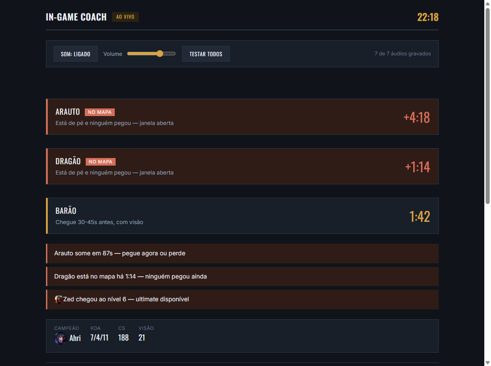

# LoL Coach — avisos, sons e luzes

Coach ao vivo para League of Legends que roda do lado do seu PC, lendo só as
APIs locais que o próprio jogo expõe. Sem Overwolf, sem injeção, sem overlay.

- **Avisos de objetivo** — cronômetro de dragão, vastilarvas, arauto, barão e
  ancião, contado a partir do evento real de morte (não de ciclo fixo). Avisa
  60s e 30s antes, quando um objetivo está livre no mapa, quando vai sumir e
  quando 2+ inimigos estão mortos com objetivo perto.
- **Nível 6** — seu e de cada inimigo.
- **Alertas seus** — escreva em português ("me avise quando o inimigo comprar
  Zhonya"), a IA monta a regra, você grava a voz. Na partida roda só a regra
  compilada: sem IA e sem internet.
- **Sons com a sua voz** — cada alerta toca um áudio gravado por você, direto
  pela página (● gravar), por arquivo (📁) ou por texto (⌨, TTS opcional).
  Alerta sem áudio aparece na tela e fica mudo.
- **Luzes RGB** — via [OpenRGB](https://openrgb.org): o nome do seu campeão +
  KILL no teclado a cada abate, double/triple/quadra/penta, first blood,
  shutdown, ace, dragão por elemento, barão, arauto, vastilarvas, contagem de
  morte, vitória/derrota, barra da tela de loading e o nome de cada campeão
  travado no draft.
- **Log e console da API** — tudo que a Live Client API expôs na partida, com
  um botão "+ alerta" em cada linha para virar aviso.



## Instalar (qualquer PC com Windows)

Abra o **PowerShell** (tecla Windows, digite `powershell`, Enter) e cole:

```powershell
irm https://raw.githubusercontent.com/caiocost/lol-coach/main/instalar.ps1 | iex
```

Ele baixa a versão mais nova, instala em `%LOCALAPPDATA%\LoL-Coach`, cria o
atalho **LoL Coach** no Menu Iniciar e na Área de Trabalho e abre a tela em
http://localhost:7778. Para atualizar, rode o mesmo comando de novo: suas vozes
gravadas, alertas e `.env` são mantidos.

Não precisa instalar Node, Python nem ffmpeg, porque vem tudo dentro do pacote.
Instalado assim, o Windows **não** mostra o aviso "O Windows protegeu o
computador": o aviso só aparece em arquivo baixado pelo navegador.

<details>
<summary>Instalar pelo zip, sem o PowerShell</summary>

1. Baixe o **`LoL-Coach-vX.Y.Z-win-x64.zip`** na página de
   [Releases](https://github.com/caiocost/lol-coach/releases/latest).
2. **Antes de extrair**: botão direito no zip → Propriedades → marque
   **Desbloquear** → OK. Isso evita o aviso do Windows.
3. Extraia numa pasta qualquer e dê dois cliques em **`Iniciar Coach.cmd`**.

Se esquecer o passo 2 e o aviso aparecer, clique em **Mais informações →
Executar assim mesmo** (o arquivo não é assinado).
</details>

Para as luzes: instale o [OpenRGB](https://openrgb.org), abra e ligue o
**SDK Server** (aba SDK Server → Start Server, porta 6742). Sem ele o coach
funciona igual, só sem luzes.

## Rodar pelo código-fonte

Requer [Node.js](https://nodejs.org) 20+ (e Python 3.10+ para as luzes).

```bash
git clone https://github.com/caiocost/lol-coach.git
cd lol-coach
npm install
pip install -r rgb/requirements.txt   # só se for usar as luzes
npm run coach
```

Abra **http://localhost:7778** e deixe num segundo monitor. A tela alterna
sozinha: mostra o draft no champ select e os avisos quando a partida começa.

Sem Python ou sem OpenRGB o coach sobe igual, só sem luzes.

### Primeiros passos

1. Abra o painel **Áudios dos alertas** e grave cada aviso (1 a 2 segundos).
   Os sete avisos de objetivo/nível já vêm com áudios de exemplo.
2. Em **Luzes**, teste os efeitos. Se tiver mais de um teclado/RAM/placa no
   OpenRGB, escolha por nome no `.env` (veja `.env.example`).
3. Em **Criar alerta**, escreva o aviso que quiser (precisa de
   `OLLAMA_API_KEY` no `.env`).

### Testar sem partida

- `http://localhost:7778/?demo=1` — partida de exemplo aos 22min
- `http://localhost:7778/?draft=1` — draft de exemplo

### Subir junto com o Windows

```powershell
powershell -ExecutionPolicy Bypass -File coach\autostart.ps1          # instala
powershell -ExecutionPolicy Bypass -File coach\autostart.ps1 -Status
powershell -ExecutionPolicy Bypass -File coach\autostart.ps1 -Remove
```

## Configuração

Tudo é opcional — copie `.env.example` para `.env`.

| Variável | Para quê |
|---|---|
| `OLLAMA_API_KEY` | criar alertas com IA |
| `FISH_API_KEY` | gerar a fala por texto (TTS) |
| `LOL_LOCKFILE` | cliente instalado fora de `C:/` ou `D:/Riot Games/...` |
| `RGB_TECLADO`, `RGB_RAM`, `RGB_PLACA` | escolher o dispositivo pelo nome |
| `DRAFT_PORT`, `INGAME_PORT`, `RGB_PORT` | trocar as portas |
| `COACH_VOZ=1` | subir com a voz ligada (o padrão é desligada) |

Os alertas que você cria ficam em `data/alertas.json`; os áudios, em
`coach/sounds/`.

## Como funciona

| Processo | Porta | Lê |
|---|---|---|
| `coach/ingame.ts` | 7778 | Live Client Data API (`127.0.0.1:2999`) — a página |
| `coach/server.ts` | 7777 | LCU do cliente (lockfile) — champ select e loading |
| `rgb/rgb_daemon.py` | 7779 | recebe os efeitos e desenha no OpenRGB a 40 fps |

A Live Client API só expõe o seu placar e eventos globais: não dá posição no
mapa, ouro do time nem wards. Os avisos usam só o que ela entrega de verdade.

## Gerar o pacote portátil

```powershell
powershell -ExecutionPolicy Bypass -File scripts\empacotar.ps1 -Versao 1.1.0
```

Sai em `dist/` um zip com `node.exe`, Python embutido + `openrgb-python` e o
launcher.

## Testes

```bash
npm test          # TypeScript
npm run test:rgb  # efeitos de luz (pytest)
```

## Licença

MIT. Não é afiliado à Riot Games.
