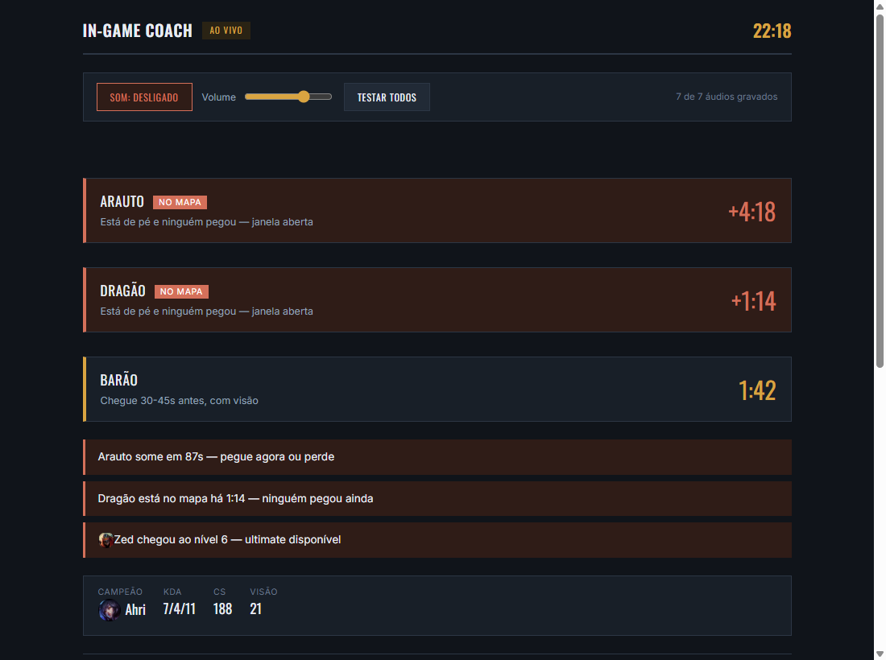
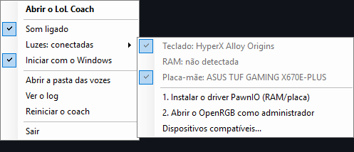
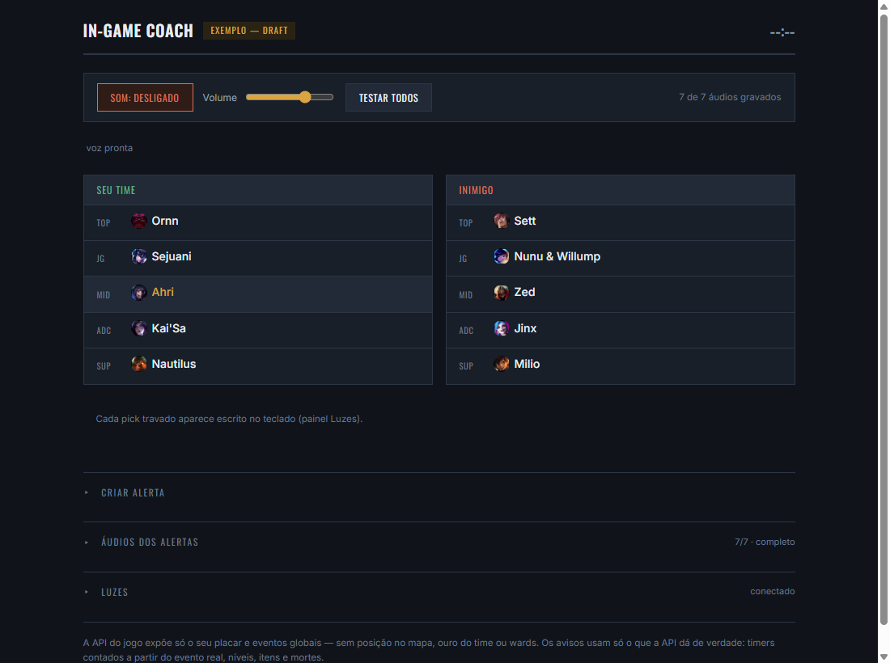
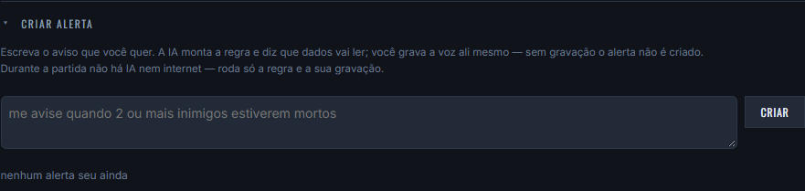
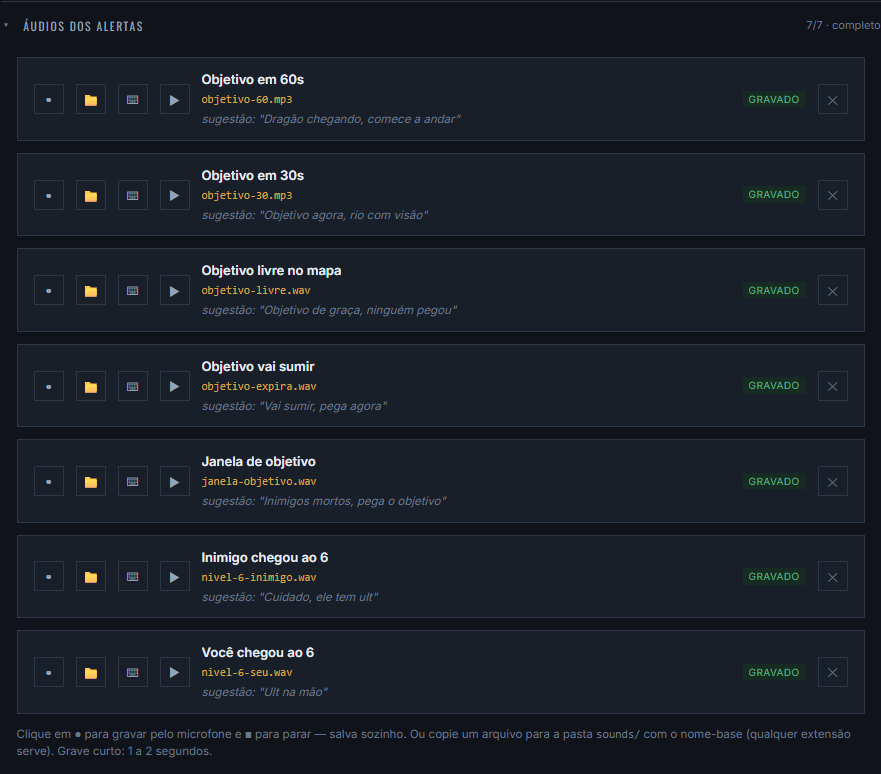
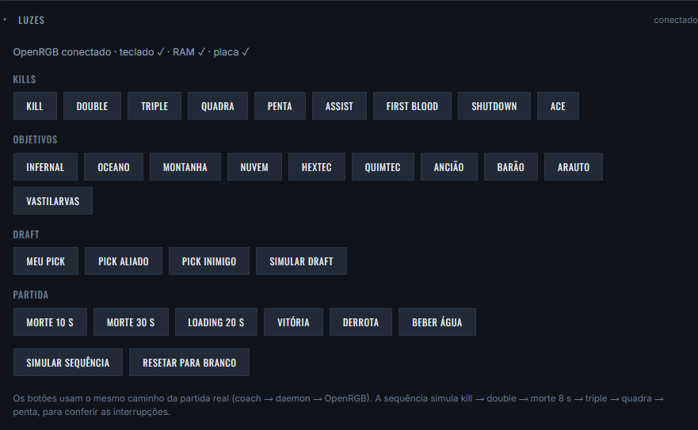

# LoL Coach — avisos, sons e luzes

Coach ao vivo para League of Legends que roda do lado do seu PC, lendo só as
APIs locais que o próprio jogo expõe. Sem Overwolf, sem injeção, sem overlay.



- **Avisos de objetivo** — cronômetro de dragão, vastilarvas, arauto, barão e
  ancião, contado a partir do evento real de morte (não de ciclo fixo). Avisa
  60s e 30s antes, quando um objetivo está livre no mapa, quando vai sumir e
  quando 2+ inimigos estão mortos com objetivo perto.
- **Nível 6** — seu e de cada inimigo.
- **Alertas seus** — escreva em português ("me avise quando o inimigo comprar
  Zhonya"), a IA monta a regra, você grava a voz. Na partida roda só a regra
  compilada: sem IA e sem internet.
- **Sons com a sua voz** — cada alerta toca um áudio gravado por você, direto
  pela página (● gravar), por arquivo (📁) ou por texto (⌨, TTS opcional).
  O som começa **desligado**: ligue no botão da página ou na bandeja.
- **Luzes RGB** — o nome do seu campeão + KILL no teclado a cada abate,
  double/triple/quadra/penta, first blood, shutdown, ace, dragão por elemento,
  barão, arauto, vastilarvas, contagem de morte, vitória/derrota, barra da tela
  de loading e o nome de cada campeão travado no draft. O
  [OpenRGB](https://openrgb.org) já vem junto.
- **Bandeja do Windows** — o coach fica perto do relógio, sem janela de
  console, com som, luzes e "iniciar com o Windows" num clique.

## Instalar (qualquer PC com Windows)

Abra o **PowerShell** (tecla Windows, digite `powershell`, Enter) e cole:

```powershell
irm https://raw.githubusercontent.com/caiocost/lol-coach/main/instalar.ps1 | iex
```

Pronto. Ele baixa a versão mais nova, instala em `%LOCALAPPDATA%\LoL-Coach`,
cria o atalho **LoL Coach** no Menu Iniciar e na Área de Trabalho, põe o ícone
na bandeja e abre a tela em http://localhost:7778. Para atualizar, rode o mesmo
comando de novo: suas vozes gravadas, alertas e `.env` são mantidos.

Vem tudo dentro do pacote: Node, Python e OpenRGB. Não precisa instalar nada
antes. Instalado assim, o Windows **não** mostra o aviso "O Windows protegeu o
computador": o aviso só aparece em arquivo baixado pelo navegador.

<details>
<summary>Instalar pelo zip, sem o PowerShell</summary>

1. Baixe o **`LoL-Coach-vX.Y.Z-win-x64.zip`** na página de
   [Releases](https://github.com/caiocost/lol-coach/releases/latest).
2. **Antes de extrair**: botão direito no zip → Propriedades → marque
   **Desbloquear** → OK. Isso evita o aviso do Windows.
3. Extraia numa pasta qualquer e dê dois cliques em **`Iniciar Coach.cmd`**.

Se esquecer o passo 2 e o aviso aparecer, clique em **Mais informações →
Executar assim mesmo** (o arquivo não é assinado).
</details>

## Bandeja do Windows

O coach roda sem janela: o ícone fica perto do relógio (no Windows 11, pode
estar na setinha **^** dos ícones ocultos; arraste para a barra para deixar
sempre à vista). Clique com o botão direito:



- **Abrir o LoL Coach** (ou dois cliques no ícone) — abre a tela no navegador.
- **Som** — liga e desliga os avisos falados.
- **Luzes** — mostra o que o OpenRGB detectou: teclado, RAM e placa-mãe.
- **Iniciar com o Windows** — sobe o coach no logon, calado, direto na bandeja.
- **Abrir a pasta das vozes**, **Ver o log**, **Reiniciar o coach** e **Sair**
  (encerra tudo, inclusive o OpenRGB que o coach abriu).

Se o coach parar sozinho, a bandeja avisa.

## A tela

Deixe http://localhost:7778 aberta num segundo monitor. Ela alterna sozinha:
mostra o draft no champ select e os avisos quando a partida começa.



**Criar alerta** — escreva o aviso em português. A IA monta a regra e mostra
quais dados vai ler; você grava a voz ali mesmo. Precisa de `OLLAMA_API_KEY`
no `.env`.



**Áudios dos alertas** — grave cada aviso pelo microfone (1 a 2 segundos),
envie um arquivo ou gere por texto. Os sete avisos de objetivo/nível já vêm
com áudios de exemplo.



### Testar sem partida

- `http://localhost:7778/?demo=1` — partida de exemplo aos 22min
- `http://localhost:7778/?draft=1` — draft de exemplo

## Luzes RGB

O pacote traz o [OpenRGB](https://openrgb.org) 1.0 e o coach abre ele sozinho,
sem janela. Se você já usa o OpenRGB, deixe o seu aberto com o **SDK Server**
ligado (porta 6742): o coach usa o seu em vez do embarcado.



O painel **Luzes** da tela tem um botão para cada efeito, para testar sem
partida.

**O que acende:**

| Dispositivo | Precisa |
|---|---|
| **Teclado RGB por tecla** | nada: funciona direto (USB). É ele que mostra os letreiros. |
| **Placa-mãe** com controlador USB (ex.: ASUS Aura USB) | nada |
| **RAM** e placas-mãe SMBus | o driver [PawnIO](https://pawnio.eu) + o OpenRGB como administrador |

**Lista de compatíveis:** [docs/dispositivos.md](docs/dispositivos.md), gerada
da lista oficial do OpenRGB e filtrada pelo que o coach consegue animar.
Testado de verdade com HyperX Alloy Origins, Kingston Fury DDR5 e ASUS TUF
GAMING X670E-PLUS.

**A RAM não acende?** A RAM conversa por SMBus, que o Windows só libera com o
driver PawnIO e com o OpenRGB rodando como administrador. Na bandeja, em
**Luzes**, aparecem os dois passos quando a RAM ou a placa não foram
detectadas:

1. **Instalar o driver PawnIO** — abre o [pawnio.eu](https://pawnio.eu).
2. **Abrir o OpenRGB como administrador** — o Windows pede confirmação e o
   coach passa a usar essa cópia com acesso à RAM.

Tem mais de um teclado, RAM ou placa? Escolha pelo nome no `.env`
(`RGB_TECLADO`, `RGB_RAM`, `RGB_PLACA`).

## Configuração

Tudo é opcional — copie `.env.example` para `.env`.

| Variável | Para quê |
|---|---|
| `OLLAMA_API_KEY` | criar alertas com IA |
| `FISH_API_KEY` | gerar a fala por texto (TTS) |
| `LOL_LOCKFILE` | cliente instalado fora de `C:/` ou `D:/Riot Games/...` |
| `RGB_TECLADO`, `RGB_RAM`, `RGB_PLACA` | escolher o dispositivo pelo nome |
| `OPENRGB_AUTO=0` | não abrir o OpenRGB embarcado |
| `DRAFT_PORT`, `INGAME_PORT`, `RGB_PORT` | trocar as portas |
| `COACH_VOZ=1` | subir com a voz ligada (o padrão é desligada) |

Os alertas que você cria ficam em `data/alertas.json`; os áudios, em
`coach/sounds/`.

## Rodar pelo código-fonte

Requer [Node.js](https://nodejs.org) 20+ (e Python 3.10+ para as luzes).

```bash
git clone https://github.com/caiocost/lol-coach.git
cd lol-coach
npm install
pip install -r rgb/requirements.txt   # só se for usar as luzes
npm run coach                         # com logs no console
```

Ou, para rodar pela bandeja: `wscript coach\bandeja.vbs`. Pelo código-fonte o
OpenRGB não vem junto: instale e ligue o SDK Server.

## Como funciona

| Processo | Porta | Lê |
|---|---|---|
| `coach/ingame.ts` | 7778 | Live Client Data API (`127.0.0.1:2999`) — a página |
| `coach/server.ts` | 7777 | LCU do cliente (lockfile) — champ select e loading |
| `rgb/rgb_daemon.py` | 7779 | recebe os efeitos e desenha no OpenRGB a 40 fps |
| OpenRGB (embarcado) | 6742 | fala com o teclado, a RAM e a placa |
| `coach/bandeja.ps1` | — | ícone da bandeja; sobe e derruba tudo acima |

A Live Client API só expõe o seu placar e eventos globais: não dá posição no
mapa, ouro do time nem wards. Os avisos usam só o que ela entrega de verdade.

## Gerar o pacote portátil

```powershell
powershell -ExecutionPolicy Bypass -File scripts\empacotar.ps1 -Versao 1.2.0
```

Sai em `dist/` um zip com `node.exe`, Python embutido + `openrgb-python`,
OpenRGB portátil e o launcher. Outros scripts de manutenção:

- `node scripts/gerar-dispositivos.mjs` — refaz `docs/dispositivos.md`
- `powershell -File scripts\print-bandeja.ps1` — refaz `docs/bandeja.png`
- `python scripts/gerar-icone.py` — refaz o ícone

## Testes

```bash
npm test          # TypeScript
npm run test:rgb  # efeitos de luz (pytest)
```

## Licença

MIT. Não é afiliado à Riot Games. O OpenRGB que vem no pacote é GPL-2.0
(licença e link do código-fonte em `runtime/openrgb/`).
